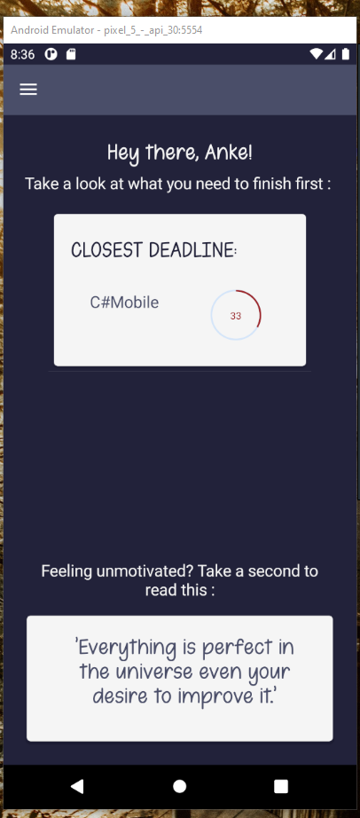
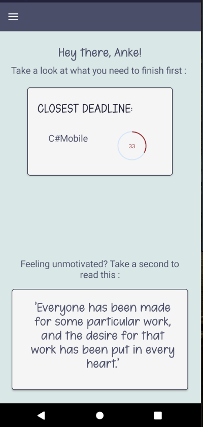

# Project C# Mobile 2021-2022
* Naam: Dubois Anke
* Onderwerp: Visual Time Management
## A lot of people (including myself) find time management something hard to achieve. Writing something down in your calendar doesn’t always mean your brain has registered that.

This app will give a visual representation of time, allowing people with for instance ADHD, ADD or other learning impairments to have a better understanding of the time still left before the next milestone or deadline in a project, giving them a better sense of control over their own life.

## Logboek

15/11/2021
--------------------------------
- Made the repository
- Contacted Syncfusion for the student license
- Looked up some extra information about MVVM - course on pluralsight
- Made the Model, View and ViewModel folder
- Views --> BASIC SKELETON
	- Homepage with a list of the projects
	- Add a project
	- Projectdetails zith a list of it's milestones
	- Add milestone
	- Milestonedetails
	- An about page that will contain some information about the application and me as a developer
	- A settings page that will contain a couple basic settings
- Models --> basic Models
	- started creating the models needed for the project, a project-model and milestone-model

22/11/2021
-------------------------------
- Added Syncfusion with the right licensing to the project.
- I had an issue with the emulator not running anymore because of my GPU, I fixed that,
 but lost a lot of time on trying to fix it, it runs without GPU now, which makes it a lot slower.
(Shouldn't be an issue on my home PC.)
- Tested Syncfusion-elements, they work
- Added some test-data to a list to use
- Started on the navigation

13/12/2021
--------------------------------
- Added Register and Login
- Figured out part of logic for progressbar
- Started adding database
- Some nav stuff

20/12/2021
--------------------------------
- Setting up database
- Still working on a fix for NullReferenceExc

30/12/221
--------------------------------
- Finished most of the setup for the database
- Delete milestone still throws an exception
- Made the first version of the logo, not quite happy yet

10/01/2022
--------------------------------
- Fixed some stuff on the database
- Added a converter
- Added a behavior
- Added a password setting
- Worked on styling

11/01/2022
--------------------------------
- Fixed the delete milestones
- Added an API that calls for inspirational quotes
- Sorted the list on the homepage and added a sort-button to the list of milestones
- Did the styling for the homepage
- Added a styled fly-out menu to the start of my application

17/01/2022
--------------------------------
- Worked on flyout and navigation
- Added a preference for the username
- did work on the welcome page, it now shows the project you need to work on first

18/01/2022
--------------------------------
- Styled the welcome page
- Made sure I can use some custom fonts
- Finished the styling on the welcome page

21/01/2022
--------------------------------
- Made sure the dates chosen are in the correct, acceptable range
- Added Add a project and Add a milestone to the flyout menu with icon
- Styled login and register-page
- Styled the settings and about-page
- Styled ProjectAdd-page
- Styled MilestoneAdd-page
- Styled the ProjectDetails-page and fixed the sorting
- Styled the MilestoneDetails-page and fixed some stuff on the welcome-page
- Users can now use a finish button to remove projects and milestones from the lists and database

22/01/2022
---------------------------------
- Spent quite somne time fixing a disposedobjectexception, eventually it looks like the syncfusion linearprogressbar was the guilty one, replaced this with the circular one, no crashes up untill now
- Added an info-button to the projectlist page
- Added a privacy page
- Fixed some smaller stuff
- Redid the logo a couple of times and added it to the menu
- Some cleanup

23/01/2022
----------------------------------
- Users now see different texts when they don't have milestones for a project yet, or do not have a username setting
- Redid the lettering to fit with the logo
- Deleted some buttons that messed with the navigation
- Added a splashcreen
- Smaller styling fixes
- Users can now clear their username
- Cleaned up the Xaml for all pages
- Added some styles
- Added Dark Mode
- Cleaned up App.xaml
- Fixed settings and about icon
- In the flyoutmenu the user can now see whether or not theyre logged in and logout
- Made a different splash screen
- Updated Readme

## Enkele screenshots

## Link video
https://youtu.be/EhFz04cB0fg

## Bronnen

Cursus C#Mobile

Documentation
https://docs.microsoft.com/en-us/xamarin/xamarin-forms/user-interface/picker/populating-itemssource

SQLite Database:
https://www.youtube.com/watch?v=XFP8Np-uRWc
https://github.com/praeclarum/sqlite-net?WT.mc_id=friends-0000-jamont
https://evolvingdeveloper.com/xamarin-local-storage-with-sqlite/
https://www.codeproject.com/Articles/1090451/Xamarin-Android-App-Using-SQLite-and-Custom-List

Firebase Login API
https://www.youtube.com/watch?v=liGTuuau29Y

Behavior
https://www.c-sharpcorner.com/article/input-validation-in-xamarin-forms-behaviors/

Converter
https://xamgirl.com/understanding-converters-in-xamarin-forms/

Quote API
https://type.fit/api/quotes

MVVM
https://www.youtube.com/watch?v=Pso1MeX_HvI&t=502s

Syncfusion elements
https://help.syncfusion.com/xamarin/introduction/overview

Custom Font
https://www.youtube.com/watch?v=HejJn2x00KI

Flyout
https://www.youtube.com/watch?app=desktop&v=sGaNlMJi-bA
https://www.youtube.com/watch?v=YDxQjb7N-P8

Splashscreen
https://docs.microsoft.com/en-us/xamarin/xamarin-forms/user-interface/splashscreen

Privacy Policy
https://app.termsfeed.com/

Datepicker dialogue
https://docs.microsoft.com/en-us/answers/questions/488323/xamarinforms-datepicker-dialogue-color-customizati.html

Preferences
https://www.youtube.com/watch?v=h8_zPtchYxc&t=677s

Dark Mode
https://www.youtube.com/watch?v=Q2F51yNHv_I

Icons
https://www.google.com/search?q=privacy+icon&sxsrf=AOaemvIvV6pgV3GXv4N9uYTF02vPVaqMLg:1642865395271&source=lnms&tbm=isch&sa=X&ved=2ahUKEwjkt7HC1sX1AhVUg_0HHfKoBKkQ_AUoAXoECAEQAw&biw=1536&bih=782&dpr=1.25#imgrc=EhMK6aWZzXtxGM

https://www.google.com/search?q=add+icon&sxsrf=AOaemvLfsXGKa_5hjTx6oHifF67_WFjx4w:1642766989710&source=lnms&tbm=isch&sa=X&sqi=2&ved=2ahUKEwjY5vr258L1AhVPQjABHTg5CFkQ_AUoAXoECAEQAw&biw=1536&bih=780&dpr=1.25#imgrc=6CmGwnFD18XJbM&imgdii=geByBtJ1w-TjdM

https://www.google.com/search?q=login+icon+png&tbm=isch&ved=2ahUKEwjpuvCx1ar1AhXMCOwKHepQD9UQ2-cCegQIABAA&oq=login+icon+png&gs_lcp=CgNpbWcQAzIECAAQQzIECAAQQzIFCAAQgAQyBQgAEIAEMgUIABCABDIFCAAQgAQyBQgAEIAEMgUIABCABDIFCAAQgAQyBggAEAcQHjoHCCMQ7wMQJ1C7FVi6HGCiHmgAcAB4AIABSYgBlQOSAQE3mAEAoAEBqgELZ3dzLXdpei1pbWfAAQE&sclient=img&ei=4_ndYam9EMyRsAfqob2oDQ&bih=780&biw=1536#imgrc=dBYuLxnWWXsblM

https://www.google.com/search?q=home+icon+png&tbm=isch&ved=2ahUKEwj-xZ6w1ar1AhUYt6QKHYH0C18Q2-cCegQIABAA&oq=home+icon+png&gs_lcp=CgNpbWcQAzIECAAQQzIFCAAQgAQyBQgAEIAEMgUIABCABDIFCAAQgAQyBQgAEIAEMgUIABCABDIFCAAQgAQyBQgAEIAEMgUIABCABFAAWJYBYJYFaABwAHgAgAE2iAFqkgEBMpgBAKABAaoBC2d3cy13aXotaW1nwAEB&sclient=img&ei=3_ndYb7aMpjukgWB6a_4BQ&bih=780&biw=1536#imgrc=5TLns6CHQMzjyM

https://www.google.com/search?q=about+icon&tbm=isch&ved=2ahUKEwiImoiA1Mj1AhXEqqQKHWX5BQUQ2-cCegQIABAA&oq=about+icon&gs_lcp=CgNpbWcQAzIHCCMQ7wMQJzIFCAAQgAQyBQgAEIAEMgUIABCABDIFCAAQgAQyBQgAEIAEMgUIABCABDIFCAAQgAQyBQgAEIAEMgUIABCABDoGCAAQCBAeOgQIABAYOgoIIxDvAxDqAhAnOggIABCxAxCDAToLCAAQgAQQsQMQgwE6CAgAEIAEELEDOgQIABBDUJYGWKUrYJ0taAJwAHgCgAFIiAGfC5IBAjI1mAEAoAEBqgELZ3dzLXdpei1pbWewAQrAAQE&sclient=img&ei=9rLtYYjHH8TVkgXl8pco&bih=780&biw=1536#imgrc=kdRPGvOgPgMSbM&imgdii=F3KQZVkPdAurEM

https://www.google.com/search?q=list%20icon&tbm=isch&hl=en&tbs=rimg:Ca_1LjRrxtx8rYS-GjOKnq1OesgIMCgIIABAAOgQIABAA&sa=X&ved=0CB4QuIIBahcKEwi4st-h1cj1AhUAAAAAHQAAAAAQCA&biw=1522&bih=780#imgrc=beXK2kNdVRWwdM

https://www.google.com/search?q=register+icon&tbm=isch&ved=2ahUKEwiZ5PSm1cj1AhUHP-wKHXgtAZUQ2-cCegQIABAA&oq=register+&gs_lcp=CgNpbWcQARgBMgcIIxDvAxAnMgQIABBDMgQIABBDMgUIABCABDIFCAAQgAQyBQgAEIAEMgUIABCABDIFCAAQgAQyBQgAEIAEMgUIABCABDoKCCMQ7wMQ6gIQJ1CwBlifEGD1GmgBcAB4AIABQYgBtwSSAQIxMJgBAKABAaoBC2d3cy13aXotaW1nsAEKwAEB&sclient=img&ei=VLTtYZnqGYf-sAf42oSoCQ&bih=780&biw=1522&hl=en#imgrc=8pwiL45rfgsh0M

https://www.google.com/search?q=settings+icon&tbm=isch&ved=2ahUKEwj43uO_1cj1AhWJlKQKHUW0DYgQ2-cCegQIABAA&oq=se&gs_lcp=CgNpbWcQARgAMgcIIxDvAxAnMgQIABBDMgQIABBDMgQIABBDMgQIABBDMgQIABBDMgQIABBDMgQIABBDMgQIABBDMgQIABBDOgUIABCABDoKCCMQ7wMQ6gIQJ1DTjQJY-JACYLeZAmgCcAB4AIABR4gBwgGSAQEzmAEAoAEBqgELZ3dzLXdpei1pbWewAQrAAQE&sclient=img&ei=iLTtYfj6IompkgXF6LbACA&bih=780&biw=1522&hl=en#imgrc=L9DcWUNvVuznCM&imgdii=J7gG--oTATnLaM

Handmade icons:
- doneicon
- deleteicon
- all logo's en splashscreen
